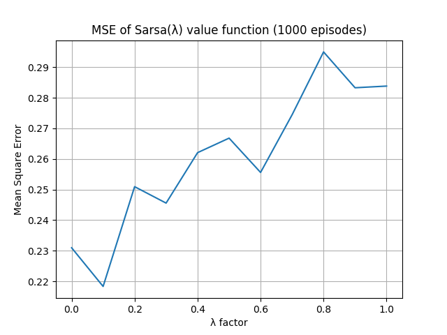

# rl-easy21
My solutions to [Easy21 assignment](http://www0.cs.ucl.ac.uk/staff/d.silver/web/Teaching_files/Easy21-Johannes.pdf) from RL course by David Silver

## Monte Carlo
Optimal value function V*(s) calculated with Monte Carlo agent running 100 000 episodes.

## Sarsa(λ)
 
 
 
